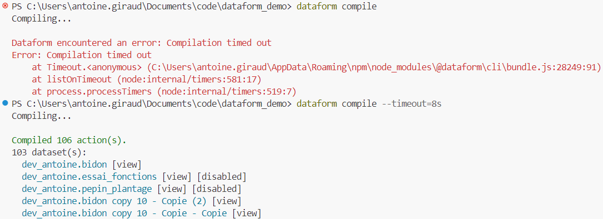

# dataform timeout - 3k column descriptions

Here is a dataform demo repo to showcase a `dataform compile` timeout

caused by ~100 views refering to `includes/doc.js` with 3k column desctions

(at homeserve, we have ~600 models with 3k+ column descriptions)

## Problem you have encountered

In order to have the same column descritions on all tables
we (at homeserve) setup a dict in a `includes/doc.js` file with 3k definitions

```js
const columns = {
  column_x: 'lorem ipsum',
  column_y: 'lorem ipsum',
  //... 3k column ...
};
module.exports = {columns};
```

used in our `table|view|operation` definitions to deploy to BigQuery the column descriptions used on those given models.

```sqlx
config {
  type: 'table|view', -- or hasOutput: true,
  columns: doc.columns,
}
```

When this dict is referenced in too many tables,
dataform web ui gives a compile timeout
stoping us in our dev.

## What you expected to happen

no compile timeout :)

## Steps to reproduce

- clone repo [AntoineGiraud/dataform_demo_compile_timeout](https://github.com/AntoineGiraud/dataform_demo_compile_timeout)
- install [dataform cli](https://cloud.google.com/dataform/docs/use-dataform-cli?hl=fr)
- try 🟠 `dataform compile` & 🟢 `dataform compile --timeout=10s`
  

## Other information (workarounds you have tried, documentation consulted, etc)

- tried to understand, without success, how dataform sends column definitions from dataform's github repo code
- explore dataform cli -> cf. attachement
  - `dataform compile` -> 🟠 timeout
  - `dataform compile --timeout=10s` -> 🟢 compiled 670 actions
- empty colmun dict in `includes/doc.js`
  - 🟠 no colmun descriptions in BigQuery
  - 🟢 dataform compile
